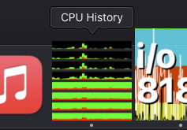

# CPU History

This is a fork of [Christopher Bowns](https://cbowns.com/cpuhistory/)' excellent CPU History application, last updated by him back in June 2008.

Here is his original summary of the program, cribbed from the above site:  

>**What is CPU History?**
>
>CPU History is an application that graphs your current CPU usage history in the Dock icon, ~~and optionally, in a floating window. You can customize colors, update frequency, and bar thickness.~~
>
>It uses very little CPU to monitor your CPU usage. I think this is a good thing. 

I wanted to continue using it, but the original application was 32-bit only, which stopped working in macOS 10.15.  
Since macOS 11, Apple moved over to their own ARM platform, meaning x86_64 code is on life support now, too.  
Christopher seems to have moved on from this project, but his web page for this application encourages forking it, so I did.  
I massaged it until it would run on a 64-bit-clean x86_64 macOS, and thereafter natively on ARM64 macOS.   

Because I am **NOT! A! DEVELOPER!** my changes are ham-fisted, inelegant, idiotic, and minimal. As long as the program builds and runs on my computer, I consider it good enough. 

What works?
- Builds and runs on macOS 15.2 'Sequoia' build 24C101
- Works natively on both Apple Silicon and x86_64
- Employs sensible default settings
- Starts 3+ times in a row without breaking

What's busted?
- Saving preferences is entirely disabled because it kept corrupting itself
- 50+ deprecation warnings etc. inside Xcode-- but nothing that stops it from building and running!

I provide a binary here in `binary/CPU History aarch64.zip` that probably won't work for you because I refuse to pay Apple €99/year for a dev account so they can sign binaries I'm giving away for free to 0 interested people.  

More than likely you'll need to clone this repo, then open the `source/CPU History.xcodeproj` file in Xcode, and build the project (navigate to Product -> Build, or mash ⌘ + B). As long as it builds, you can just ignore all the warnings. The compiled application will be in `/Users/YOURUSERNAME/Library/Developer/Xcode/DerivedData/CPU_History-somethingsomethingsomething/Build/Products/Development/CPU History.app`. Move it to `/Applications` and run it. 
